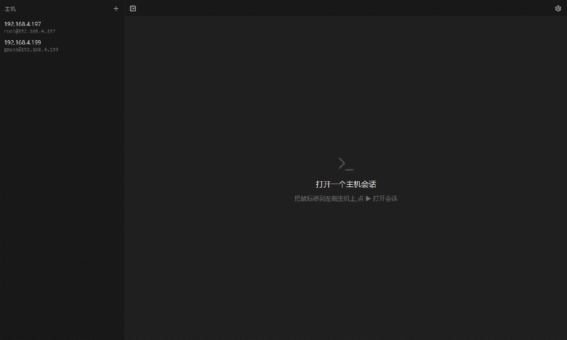

# GoSSH — an SSH client that lives in your browser

**English** | [简体中文](README.zh.md)

An SSH client built on the Go stack: a small local server runs on your
machine and your browser **is** the terminal UI. Manage a host inventory,
keep multiple sessions in tabs, set up port forwards, and store credentials
in the system keyring.



```
gossh serve
# HTTP server is listening at: http://127.0.0.1:8040
# Open the page with the access token:
#   http://127.0.0.1:8040/?token=4f0a...
```

Open the printed URL and you are in. The server only listens on
`127.0.0.1` and is guarded by an access token — private keys never leave
the process.

## Features

- **Host inventory**: create/update/delete
- **Multi-session tabs**: SSH sessions side by side; drag tabs to
  reorder, order persisted per device in localStorage (`gossh.tabOrder`)
- **Credentials**: private key paths, ssh-agent, or passwords; passwords
  and key passphrases are stored encrypted in the system keyring
  (Linux Secret Service / macOS Keychain / Windows Credential Manager),
  falling back to in-memory only when no keyring daemon is available
- **Host keys**: TOFU trust management (`~/.gossh/known_hosts`); a
  changed key refuses the connection
- **Port forwards**: local / remote / dynamic (SOCKS5); host-level
  forwards run on a dedicated per-host forward connection, outliving any
  interactive session (session close does not drop them, see
  [ADR 0007](docs/adr/0007-host-forwards-resident.md))
- **Local server**: the first row of the host list is a built-in entry
  (127.0.0.1) that opens a terminal on the machine running gossh — a local
  PTY, no SSH and no credentials. Connect-only: it cannot be edited,
  forwarded or deleted (see [ADR 0008](docs/adr/0008-local-server.md))
- **Detach-surviving sessions**: closing or refreshing the browser does
  not kill the SSH session; it idles out (default 900s) before teardown
- **One binary**: the frontend is embedded via `go:embed`; cross-compiles
  with no Node runtime required
- **Desktop mode (Linux + Windows)**: `gossh app` stays resident in the
  system tray with autostart, single-instance locking, auto-opens the
  browser with the token injected; Linux releases ship a portable
  AppImage, the Windows binary needs nothing extra

## Installation

```sh
curl -fsSL https://raw.githubusercontent.com/gausszhou/gossh/main/scripts/install.sh | sh
# options: sh install.sh --version v0.0.1 --prefix ~/.local --repo owner/gossh
```

The script runs the same flow on every platform: detect OS/arch → download the
platform archive (tar.gz) and verify its sha256 → extract the binary to
`~/.local/bin` → **idempotently** append that dir to `~/.bashrc` (skips when
the same line already exists, so re-runs are safe) → if `~/.profile` exists,
append a `. ~/.bashrc` bridge line idempotently (so login shells like Git Bash
load `~/.bashrc`; only when it does not reference bashrc yet) → prompt
`source ~/.bashrc` to take effect.

Native Windows PowerShell installer (same flow; registers PATH in the
PowerShell profile instead of `.bashrc`):

```powershell
powershell -ExecutionPolicy Bypass -File install.ps1
# options: -Version v0.0.1 -Prefix D:\tools -Repo owner/gossh
```

or build from source (Go 1.26+; a frontend build needs Node 18+ / pnpm):

```sh
make build      # frontend + embedded static + ./build/gossh
make release    # 5-platform matrix + sha256sums.txt
```

## Usage

### Serve

```sh
gossh serve                          # 127.0.0.1:8040 by default, prints the token URL
gossh serve --port 0                 # random port
gossh serve --token my-token         # fixed token
gossh serve --timeout 3600           # seconds a detached session survives (0 = never)
gossh serve --ws-origin '^http://127\.0\.0\.1'   # extra WebSocket origin restriction
```

First-run flow:

1. Add hosts with `gossh hosts add` or through the "new host" form in
   the browser;
2. Hover a host row and click the ▶ button — enter a password / key
   passphrase when asked, optionally "save to keyring";
3. Work in the session tab; port forwards and edit/delete live in the
   host row actions and its right-click menu.

### Desktop mode

```sh
gossh app              # tray-resident server + auto-opens the browser (token injected)
gossh app --no-browser # enter the tray without opening the browser (used by autostart)
```

- The server and the tray live in the same process: closing the browser
  does not stop sessions; only the tray "quit" item tears the server down
- Re-running `gossh app` just opens the UI of the running instance
  (single instance: `flock ~/.gossh/app.lock` on Linux, a named mutex
  `Local\gossh-app-<user>` on Windows)
- Tray menu: **open UI / autostart (toggle) / quit**
  - Linux: autostart state is the existence of
    `~/.config/autostart/gossh.desktop`
  - Windows: autostart is the `GoSSH` value under HKCU
    `...\CurrentVersion\Run`; `gossh app` works on the stock
    `make build` Windows binary (pure-Go Win32 tray, no cgo, no
    extra runtime)
- On Linux desktops, grab the **AppImage** from a release: double-click
  to run, no installation
- Linux tray needs GTK/AppIndicator (cgo): a `CGO_ENABLED=0` build (the
  default `make build`) tells you to use `gossh serve` instead; AppImage
  and CI builds carry cgo
- See [ADR 0006](docs/adr/0006-desktop-app.md)

### CLI

Every command group below drives a **running** server (`gossh serve` /
`gossh app`), which owns the host inventory, the trust store, the keyring and
the sessions — so the CLI is a stateless client and never touches the files
underneath a live server. The address and token come from the same config
file `gossh serve` reads (default `~/.gossh/config.json`, so a stock setup
needs no flags); `--server` / `--token` (or `GOSSH_SERVER` / `GOSSH_TOKEN`)
override them. On a TTY you get a human table; piped or redirected you get
JSON, so `... | jq` works for free.

Host inventory:

```sh
gossh hosts ls                                  # the built-in local server is the first row
gossh hosts add --name prod --address 10.0.0.5 --user root --key ~/.ssh/id_ed25519
gossh hosts add --name bastion --address 1.2.3.4 --user ops --password --secret -
gossh hosts show prod                           # by id or by name
gossh hosts edit prod --name production         # only the flags you pass change
gossh hosts rm prod
gossh version
```

`--secret -` reads the secret from stdin; without it nothing is written to the
keyring. A `--secret` value typed inline is visible in the process list.

Resident port forwards (configured on the host record, applied by the host's
own forward connection — they outlive any session, see
[ADR 0007](docs/adr/0007-host-forwards-resident.md)):

```sh
gossh hosts forwards ls   prod                  # config + runtime status (running/pending/failed)
gossh hosts forwards add  prod --kind local --bind 127.0.0.1:8080 --target localhost:80
gossh hosts forwards rm   prod --bind 127.0.0.1:8080
```

Trust store, keyring and the deployment-wide page title:

```sh
gossh known-hosts ls                            # pinned TOFU fingerprints
gossh known-hosts forget 10.0.0.5:22            # forget it → trusted again on the next connect
gossh secrets set --kind password --addr 10.0.0.5:22 --user root --secret -
gossh secrets set --kind passphrase --key ~/.ssh/id_ed25519 --secret -
gossh secrets rm  --kind password --addr 10.0.0.5:22 --user root
gossh title get
gossh title set "My fleet"
gossh title clear                               # back to the built-in title
```

#### Driving sessions (`gossh session`)

`gossh session` is the command-line face of the [agent-driving API](docs/design/agent-driving-api.md)
(`GET /screen`, `POST /wait`, `POST /keys`). It is a **stateless, one-shot
HTTP client** — the sessions live in a server you already have running
(`gossh serve` / `gossh app`), and the CLI never opens a PTY of its own. The
design follows [terminal-use](https://github.com/flipbit03/terminal-use):
`--session` targeting, named keys, and "human text on a TTY, JSON when piped".

```sh
gossh session ls                          # sessions on the running server
gossh session create --host prod          # connect a host, print the id
gossh session type "ls -la" --enter       # type text (--enter submits it)
gossh session wait --text 'password:'     # block until the screen matches
gossh session screen                      # read the rendered screen
gossh session screen --png -o shot.png    # render a PNG
gossh session press Ctrl+C                # send named keys
gossh session press Escape : w q Enter    # …as one sequence
gossh session rename deploy-window        # title, persisted on the server
gossh session resize --cols 200 --rows 50 # resize the PTY (drives screen/PNG size)
gossh session signal SIGTERM              # signal the session's process
gossh session forwards ls                 # the session's own temporary forwards
gossh session forwards add --kind local --bind 127.0.0.1:9000 --target localhost:80
gossh session forwards rm <forward-id>
gossh session destroy                     # alias: kill
gossh session usage                       # one-screen reference
```

- **Targeting.** `-s/--session` takes a full id, a unique id prefix, or a
  title/host name. Omit it and the only live session is used; with several
  live sessions the CLI lists them and asks you to pick.
- **Output.** On a TTY you get a human table / plain text; piped or redirected
  you get JSON, so an agent gets structured output for free. `--json` forces
  either mode (`screen --png` is the one exception — an image has no JSON form).
- **Named keys.** `type` sends literal text; `press` sends named keys —
  `Enter`, `Tab`, `Escape`, arrows, `PageUp`/`PageDown`, `F1`–`F12`, modifiers
  (`Ctrl+C`, `Alt+f`, `Shift+Tab`, `Ctrl+Shift+Up`) and any single character.
  The server takes **raw bytes** on purpose (no key-name translation), so the
  client does the mapping.
- **Prerequisites.** Reading a screen needs the server's screen mirror
  (`--mirror`, on by default); writing needs `--permit-write` (also on by
  default). A read-only deployment answers writes with 403 and the CLI says so.
- **Address & token** come from the same config file `gossh serve` reads
  (default `~/.gossh/config.json`), so a stock setup needs no flags;
  `--server` / `--token` (or `GOSSH_SERVER` / `GOSSH_TOKEN`) override it.
- **Two levels of forwards.** `gossh session forwards` are temporary and ride
  the session's SSH connection (a local-server session has none, and the CLI
  says so); `gossh hosts forwards` live on the host record and outlive
  sessions.
- **`signal` is not `destroy`.** `gossh session signal SIGTERM` signals the
  process behind the session; `gossh session destroy` (alias `kill`) tears the
  whole session down on the server.

A typical agent drive loop:

```sh
id=$(gossh session create --host prod --json | jq -r .id)
gossh session wait   -s "$id" --text 'login:' --timeout 20000
gossh session type   -s "$id" 'deploy' --enter
gossh session wait   -s "$id" --stable 2000
gossh session screen -s "$id"
gossh session destroy -s "$id"
```

See the [agent-driving API reference](docs/design/agent-driving-api.md) for the
HTTP contract the CLI wraps.

## Security model

- Listens on `127.0.0.1` only; a random access token gates every
  `/api/*` call and the WebSocket (`Authorization: Bearer` /
  `X-Gossh-Token` / `?token=`), compared in constant time — see
  [ADR 0005](docs/adr/0005-access-token-posture.md)
- Passwords and passphrases go to the system keyring only, never to disk
  in plain text; nothing is persisted when the keyring is unavailable
- TOFU host-key verification applies to every hop, including jump
  hosts; a fingerprint mismatch refuses the connection
- Data never leaves the local process; if you expose the server to the
  network, terminate TLS via a reverse proxy and use `--ws-origin`
- The built-in local server runs commands on the machine hosting gossh:
  anyone holding the access token can execute anything as that user. Keep
  the loopback default; the local shell defaults to Git Bash on Windows
  (then PowerShell) and to `$SHELL` on Unix — `GOSSH_LOCAL_SHELL` overrides it

## Architecture

```
internal/api        HTTP/WS routing, token, hosts/forwards handlers
internal/session    session registry and lifecycle (idempotent create,
                    preemption, idle expiry — ported from gotty)
internal/terminal   browser binary frame protocol ("webtty", ported from gotty)
internal/sshtty     the session.Terminal implementation over SSH (remote PTY shell)
internal/localtty   the session.Terminal implementation for the local server
                    (local PTY: /dev/ptmx on Unix, ConPTY on Windows)
internal/sshx       direct dialing, credential resolution, TOFU trust store,
                    keyring
internal/host       host inventory (hosts.json)
apps/web            Vue3 + Vite + xterm.js (tabs / host inventory)
```

See `docs/adr/` (0001–0008), `CONTEXT.md` (domain glossary) and
`docs/design/` (agent-driving API, WebSocket multiplexing, UI style guide).

## Development

```sh
make install   # pnpm install
make build     # frontend + static + ./build/gossh
make test      # go vet + gofmt + go test (including core tests ported from gotty)
make release   # linux/amd64+arm64, darwin/amd64+arm64, windows/amd64
scripts/build-local.ps1   # Windows: build + install to ~/.local/bin in one go
scripts/build-local.sh    # same, in sh: Git Bash / Linux / macOS
scripts/smoke.sh   # end-to-end smoke against a local sshd
```

## License

MIT.